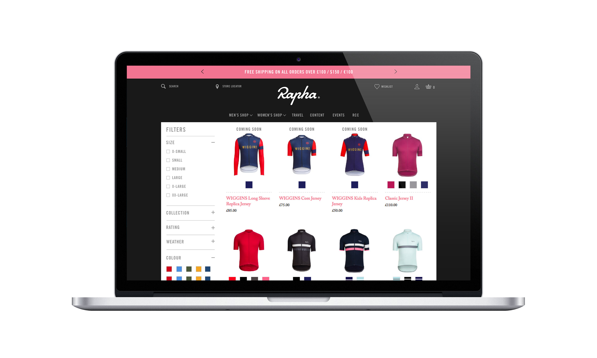

<h2 class="orange fw6">The Brief:</h2>
As a business we’re looking to add more filtering capability so that users can find products and content easier across the website. This will be present on category/collection pages and also on search results. In addition we need to ensure that the filters work well on a small screen devices as over 45% of traffic is on mobile & tablet.

<h2 class="orange fw6">The Problem:</h2>
The current filtering is very limited, users can only filter by size and there is no way to sort between the different collections such as "Pro Team" & "Brevet". As the collection grows it becomes increasingly difficult for users to navigate the shop pages, an improved filter should more visible and allow users to refine there results more effectively.

<h2 class="orange fw6">Competitive Analysis:</h2>
It was important to see how our competitors tackled filtering so we looked at 3 direct competitors: Assos, Castello & Vulpine and 3 indirect competitors: Nike, John Lewis & Evans Cycles. Our direct competitors aren’t really offering much in the way of filtering to customers, Vulpine has widest selection of facets despite having a much smaller catalog than Rapha. The indirect competitors are much more advanced at this, giving customers many more options for refining their results. Rapha is clearly lacking in this department but it shows we have a big opportunity to make an improvement.

<figure class="mh0 mv3">
  
</figure>

<h2 class="orange fw6">The Insight:</h2>
We know that in the current format, filters are missed by most customers - less than 1% interact with them, with an incremental conversion rate of + 145%. If we increase the number of interactions we can the increase conversion rate. 

<blockquote class="f2 measure-narrow center lh-title i mid-gray bl bw2 pl4 border-box b--orange">“Less than 1% of current sessions include filter interactions” <cite class="f6 db mt3 fs-normal orange">Rapha Google Analytics, June 2016</cite></blockquote>


<h2 class="orange fw6">The Idea:</h2>
A simple, easy to find and use filter that can evolve as we buildout more facets in Hybris. The filter will be designed mobile first, this is an ever growing segment of traffic and browsing large collections is much harder on a small screen. The results must be live and react to the users selection, ideally without a page refresh to give a seamless interaction. Finally, the filter must always display a result, we will have to guide the user to prevent a no result situation.

<h2 class="orange fw6">Testing & Iteration:</h2>
We tested different versions of the desktop & mobile filters with staff and Rapha customers in-store, the response to the work was very positive - customers were happy to see that changes were being considered to the current filtering system. With the mobile sketches, users felt that the filters were far too long when each facet had a list format, this was changed to a grid layout to prevent needless scrolling. Users wanted keep the filters at the top of the page and have the products scroll underneath them, we changed the design to allow for a persistent filter option on both desktop and mobile.
<figure class="mh0 mv3">
  
</figure>
I designed four desktop versions, one being "Sale Mode" which can be turning on during a sale period for easy access to size filtration. When testing the other three options it was clear that having the filters sit at the top didn't work for desktop, users were much more familiar with the filters on the left hand side.

**Sale time filters:**

<figure class="mh0 mv3">
  
</figure>

**Other versions:**

<figure class="mh0 mv3">
  
</figure>

<h2 class="orange fw6">Final Mobile Screens:</h2>

<figure class="mh0 mv3">
  
</figure>

<h2 class="orange fw6">Final Desktop Screens:</h2>

<figure class="mh0 mv3">
  
</figure>

<h2 class="orange fw6">Outcome:</h2>
<blockquote class="f2 measure-narrow center lh-title i mid-gray bl bw2 pl4 border-box b--orange">“Implementation of the Sale Filter saw engagment reach 60%”<cite class="f6 db mt3 fs-normal orange">Rapha Google Analytics, August 2016</cite></blockquote>
After implementation, in an average month the sessions that included filter interaction had increased to 5%, this reached 60% during the sale period when using the sale - size only filter. We delivered a much improved filtering module that will be flexible enough to grow with the company and enable new facets to be added as and when the data is available. The user can see the number of results returned as they go through the filters, if no results are available they will not be able to proceed to apply the filter but, be prompted to change their selection. Once the filter has been applied, the results load without the whole page refreshing, a faster more streamlined experience for filtering products. 

