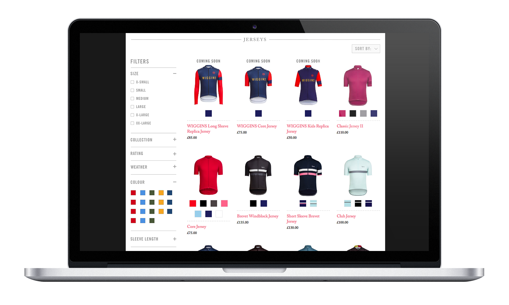

<h2 class="orange fw6">The Brief:</h2>
As a business we’re looking to add more filtering capability so that users can find products and content easier across the website. This will be present on category/collection pages and also on search results. In addition we need to ensure that the filters work well on a small screen devices as over 45% of traffic is on mobile & tablet.

<h2 class="orange fw6">The Problem:</h2>
The current filtering is very limited, users can only filter by size and there is no way to sort between the different collections such as "Pro Team" & "Brevet". As the collection grows it becomes increasingly difficult for users to navigate the shop pages, an improved filter should more visible and allow users to refine there results more effectively.

<h2 class="orange fw6">Competitive Analysis:</h2>
It was important to see how our competitors tackled filtering so we looked at 3 direct competitors: Assos, Castello & Vulpine and 3 indirect competitors: Nike, John Lewis & Evans Cycles. Our direct competitors aren’t really offering much in the way of filtering to customers, Vulpine has widest selection of facets despite having a much smaller catalog than Rapha. The indirect competitors are much more advanced at this, giving customers many more options for refining their results. Rapha is clearly lacking in this department but it shows we have a big opportunity to make an improvement.

<figure class="mh0 mv3">
  
</figure>

<h2 class="orange fw6">The Insight:</h2>
80% of users who interact with the filter go on to complete a purchase but only 5% of total users interact with the filters. If we can increase the number of interactions we can increase conversion.

<blockquote class="f2 measure-narrow center lh-title i mid-gray bl bw2 pl4 border-box b--orange">“80% Big Long Statistic about something really insightful and clever.” <cite class="f6 db mt3 fs-normal orange">Rapha Google Analytics, June 2016</cite></blockquote>


<h2 class="orange fw6">The Idea:</h2>
A simple, easy to find and use filter that can evolve as we buildout more facets in Hybris. The filter will be designed mobile first, this is an ever growing segment of traffic and browsing large collections is much harder on a small screen. The results must be live and react to the users selection, ideally without a page refresh to give a seamless interaction. Finally, the filter must always display a result, we will have to guide the user to prevent a no result situation.

<h2 class="orange fw6">Testing & Iteration:</h2>
We tested three versions of the desktop & mobile filters with staff and Rapha customers instore.

<h2 class="orange fw6">Final Mobile Screens:</h2>

<figure class="mh0 mv3">
  
</figure>

<h2 class="orange fw6">Final Desktop Screens:</h2>

<figure class="mh0 mv3">
  
</figure>
