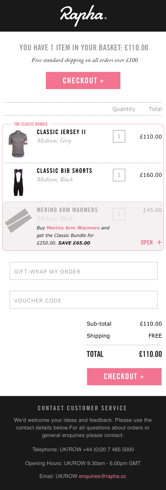
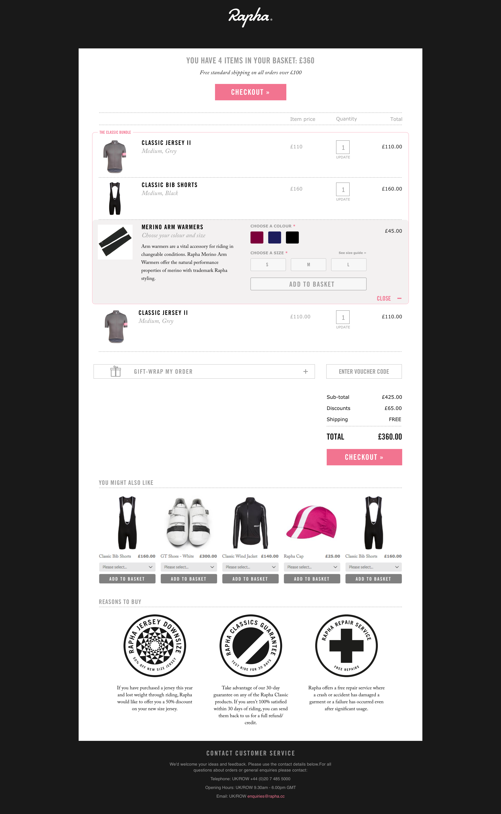

<h2 class="orange fw6">The Brief:</h2>
Revisit the Basket Summary page design, look at the information that is currently displayed, what is useful for our customers? Hierarchy of information, what do most people want to know? Calls to action, are these clear? Summary of basket content, how is this displayed on mobile and can we optimise it further?

<h2 class="orange fw6">The Problem:</h2>
The current Basket Summary page is a exit point for X% of visitors, improving this bounce rate will help increase conversion. We know the page has some irrelevant information for users and could have clearer calls to action about the fold, especially when viewing on a mobile device - the basket summary can be very long and the CTA is right at the bottom of the screen.

<h2 class="orange fw6">The Insight:</h2>
We know that 63% of users who add to cart do not proceed to purchase. The basket summary is the gateway to checkout, the obvious place to start when trying to increase the percentage of users who complete a purchase.

<blockquote class="f2 measure-narrow center lh-title i mid-gray bl bw2 pl4 border-box b--orange">“63% of sessions with add to cart did not result in a transaction.” <cite class="f6 db mt3 fs-normal orange">Rapha Google Analytics, July 2016</cite></blockquote>


<h2 class="orange fw6">The Idea:</h2>
By improving the basket summary page, removing unnecessary information, making the call to action clear and highlighting offers and savings we can improve our conversion rate. Currently the Basket Summary page does not deal with promotions very clearly, it will direct users back to the shop if they have qualified for an offer. If we can allow users to add to basket within the Basket Summary page we can keep them in the checkout process and make it easier for them to transact.

<h2 class="orange fw6">Testing & Iteration:</h2>
All testing for the Basket Summary was done in-house with the view to develop a cleaner and easier to understand page that could be tested on the live site with real users. This would give a more accurate indication of how the new version was performing and the amount of traffic to the new page could be easily controlled and ramped up as and when necessary.

<h2 class="orange fw6">Final Mobile Screens:</h2>

  

    <h4 class="orange tc">Stage 1</h4>
    <figure class="fl w-100 ma0 mb4 pa0 relative ba bw4 b--white br4 shadow-4 border-box iphone-mask">
      

        
      

    </figure>
  

  

    <h4 class="orange tc">Stage 2</h4>
    <figure class="fl w-100 ma0 mb4 pa0 relative ba bw4 b--white br4 shadow-4 border-box iphone-mask">
      

        
      

    </figure>
  

  

    <h4 class="orange tc">Stage 3</h4>
    <figure class="fl w-100 ma0 mb4 pa0 relative ba bw4 b--white br4 shadow-4 border-box iphone-mask">
      

        
      

    </figure>
  

  

    <h4 class="orange tc">Stage 4</h4>
    <figure class="fl w-100 ma0 mb4 pa0 relative ba bw4 b--white br4 shadow-4 border-box iphone-mask">
      

        
      

    </figure>
  

  <h2 class="orange fw6">Final Desktop Screen:</h2>

  <figure class="fl w-100 w-80-l mh6-l ma0 mb4 pa0 relative ba bw4 b--white br4 shadow-4 border-box ipad-mask">
    

      
    

  </figure>

<h2 class="orange fw6">Outcome:</h2>
A much cleaner and easier to understand Basket Summary. We have added a summary to the top of the page, including number of items, total cost, shipping information and a CTA for checkout to allow users to proceed without unnecessary scrolling. Promotional items or bundled offers are much clearer to understand and qualifying products can be added to basket without leaving the basket summary page. This process has been optimised for mobile screens by allowing the user to expand information shown, keeping page lengths to a minimum and viewing size guide information in a modal dialog window if needed.

This work is now ready for development and will be released then A/B tested on the live site.

