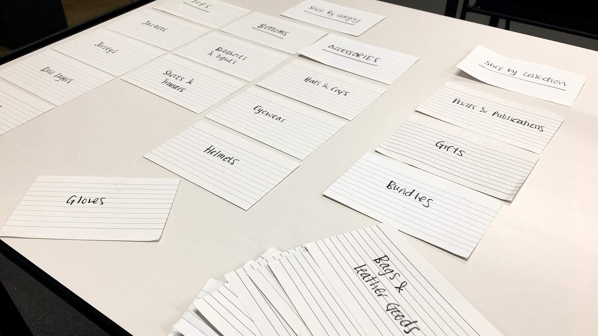
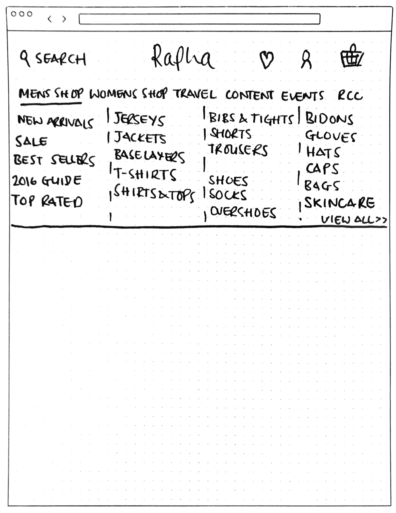
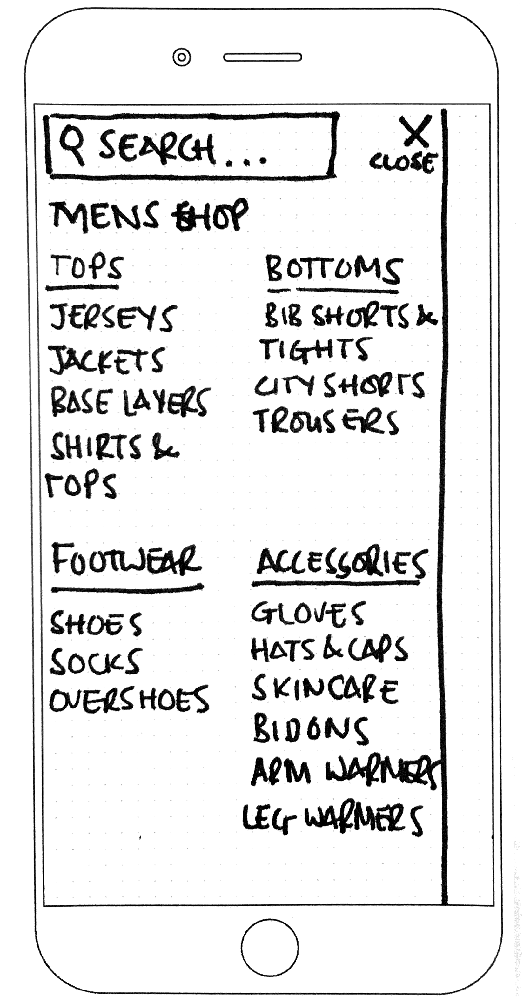
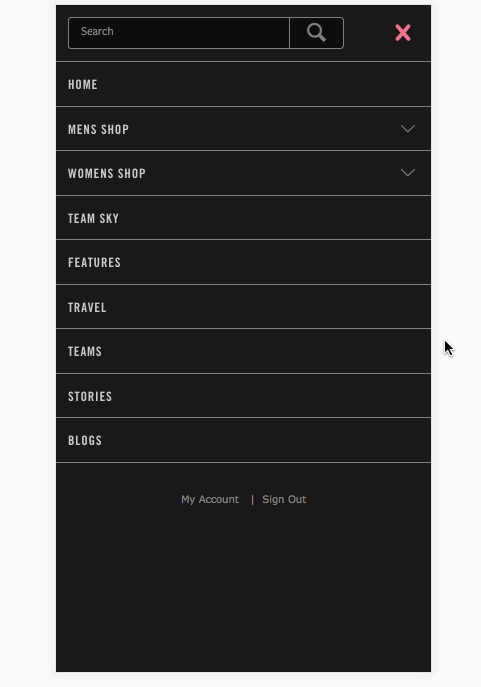
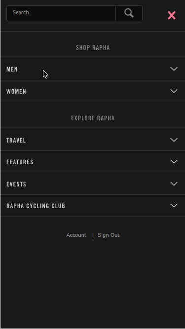
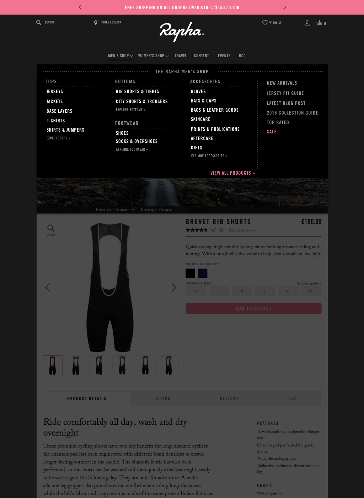

<h2 class="orange fw6">The Brief:</h2>
Test existing Rapha navigation with customers and assess its effectiveness. Look at the information architecture and suggest a more user-friendly approach that will enable new customers to navigate the site without much prior knowledge of the cycling industry. Create a navigation that has a better balance of content and commerce, these areas are currently very separate and by creating more links between the two, we can extend time spent on site and page views.

<h2 class="orange fw6">The Problem:</h2>
Rapha's navigation has grown with the company, at the beginning the product catalogue was less than 10 items and so it was easy for customers to find what they were looking for. The range now exceeds 350 product lines covering a wide range of types, the navigation has grown piecemeal with the collection and has never been appraised for its effectiveness. We need to observe how the current navigation is being used and find out how our customers would expect the products to be categorised.

<h2 class="orange fw6">The Insight & Research:</h2>
We know that most users on the site interact with the primary navigation, the rest use the featured items on the homepage or enter directly on a product page or category.
<blockquote class="f2 measure-narrow center lh-title i mid-gray bl bw2 pl4 border-box b--orange">“87% of sessions include an interaction with the primary navigation” <cite class="f6 db mt3 fs-normal orange">Rapha Google Analytics, Sept 2016</cite></blockquote>
This really shows how important the navigation is but we need to take a look at how its currently being used before we can work out how to improve it.

First off was to carry out a card sorting exercise, we got users to sort products into categories that made the most sense for them. Most users like the way that products are organised, not because they make the most sense but because they have used the site for many years and are used to the information architecture. In the card sorting we found that users didn't really know what Riding Accessories meant, they wanted to see the sections within such as Bidons (Water Bottles) and Leg & Arm Warmers as separate headings. The other thing we found during the card sort was that users tended to group the products by area of the body, using Tops, Bottoms, Footwear, Headwear and Accessories as section titles that Jerseys, Bib Shorts, Shoes, Hats and Bidons could live under.
<figure class="mh0 mv3">
  
</figure>

We used Optimal Sort to perform a Treejacking exercise, this allowed us to set up a navigation heirachy and then ask users to perform various tasks, such as "If you wanted to buy a Jersey, where would you look?" This then showed us where our users expected to find items and gave us a lot of insight into the problem areas.

**"Where would you expect to find an Essentials Case?"**

<figure class="mh0 mv3">
  
</figure>

The correct answer for this is in Bags & Leather goods, only X users got this correct.

**"Navigate to the section where you might buy a pair of Leg Warmers"**

<figure class="mh0 mv3">
  
</figure>

Leg Warmers live in "Riding Accessories" this seemed to be an area of great confusion for users with only X getting the correct path. The term is much too broad and encompasses too much, we need to address this and consider splitting out various types of items into their own headings.

**"If you wanted to attend a Rapha Event or Ride, where would you find out more?"**

<figure class="mh0 mv3">
  
</figure>

Rapha host a lot of events and also regular rides which are free for anyone to attend. These are a great way of people interacting with the brand beyond the website and a really important part of what we do, this task really highlights that people don't know where to look and we could do a much better job at surfacing the information.


<h2 class="orange fw6">The Idea:</h2>
With more and more people joining the cycling revolution we need our product catalogue to be easy for new customers to understand. We know that "Riding Accessories" is a very confusing term as it could cover most items, users expect products to be grouped by type eg. Tops and that even though Rapha Events & Rides are a large selling point for the company, they are very difficult to find, even by the most seasoned Rapha Customers. By better categorising the products and changing the primary navigational headings we can make it easier for both new and existing customers to find what they are looking for.

<h2 class="orange fw6">Testing & Iteration:</h2>

<figure class="mh0 mv3">
  
</figure>

   

   <h4 class="tc fw6">Stage 1</h4>
   <figure class="mh0 mv3">
  
</figure>

  <h4 class="tc fw6">Stage 2</h4>
   <figure class="mh0 mv3">
  
</figure>

  <h4 class="tc fw6">Stage 3</h4>
   <figure class="mh0 mv3">
  
</figure>

  <h4 class="tc mb2 fw6">Stage 1</h4>
  
Hello my name is jonathan francis heslop

	<figure class="mh0 mv3">
  
	</figure>
	

  <h4 class="tc mb2 fw6">Stage 2</h4>
  
Hello my name is jonathan francis heslop

	<figure class="mh0 mv3">
	
	</figure>
	

<h2 class="orange fw6">Final Mobile Screens:</h2>

  

    <h4 class="orange tc fw6">Stage 1</h4>
    <figure class="fl w-100 ma0 mb4 pa0 relative ba bw4 b--white br4 shadow-4 border-box iphone-mask">
      
    </figure>
  

  

    <h4 class="orange tc fw6">Stage 2</h4>
    <figure class="fl w-100 ma0 mb4 pa0 relative ba bw4 b--white br4 shadow-4 border-box iphone-mask">
      
    </figure>
  

  

    <h4 class="orange tc fw6">Stage 3</h4>
    <figure class="fl w-100 ma0 mb4 pa0 relative ba bw4 b--white br4 shadow-4 border-box iphone-mask">
      
    </figure>
  

  

    <h4 class="orange tc fw6">Stage 4</h4>
    <figure class="fl w-100 ma0 mb4 pa0 relative ba bw4 b--white br4 shadow-4 border-box iphone-mask">
      
    </figure>
  

  

    <h4 class="orange tc fw6">Stage 4</h4>
    <figure class="fl w-100 ma0 mb4 pa0 relative ba bw4 b--white br4 shadow-4 border-box iphone-mask">
      
    </figure>
  

<h2 class="orange fw6">Final Desktop Screen:</h2>

  

    <h4 class="orange tc fw6">Stage 1</h4>
    <figure class="fl w-100 ma0 mb4 pa0 relative ba bw4 b--white br4 shadow-4 border-box ipad-mask">
      

        
      

    </figure>
  

  

    <h4 class="orange tc fw6">Stage 2</h4>
    <figure class="fl w-100 ma0 mb4 pa0 relative ba bw4 b--white br4 shadow-4 border-box ipad-mask">
      

        
      

    </figure>
  

  

    <h4 class="orange tc fw6">Stage 3</h4>
    <figure class="fl w-100 ma0 mb4 pa0 relative ba bw4 b--white br4 shadow-4 border-box ipad-mask">
      

        
      

    </figure>
  

<h2 class="orange fw6">Outcome:</h2>
We have three navigations that can be developed and multi-variant tested on the live site.

