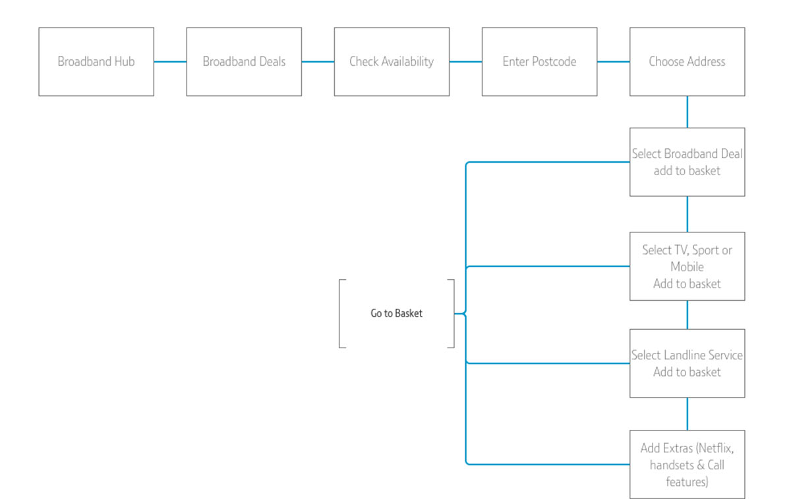

## Introduction

Digital transformation of the BT.com storefront using Adobe Experience Manager. A UX led project to build a component library that could facilitate all Broadband, TV and Sports sales journeys. 

## The Problem

The BT consumer website is outdated, any change to pricing or content needs to be facilitated through developers as there isn’t a CMS in place. The majority of the site needs to be redesigned into reusable components, the aim is to bring consistency to the site and design should be user led. 

### Service checker flows:

  <figure class="fl w-50 border-box pr3 mh0 mv3">
    
  </figure>

  <figure class="fl w-50 border-box pl3 mh0 mv3">
    
  </figure>

### Service checker wireframes:

  <figure class="fl w-third border-box ph3 mh0 mv3">
    
  </figure>

  <figure class="fl w-third border-box ph3 mh0 mv3">
    
  </figure>

  <figure class="fl w-third border-box ph3 mh0 mv3">
    
  </figure>

### Broadband deals:

<figure class="mh0 mv3 ba b--light-silver">
  
</figure>

### TV Channel Explorer: 

<figure class="mh0 mv3 ba b--light-silver">
  
</figure>

### Product card variations:

<figure class="mh0 mv3 ba b--light-silver">
  
</figure>

### Desktop Tables:

<figure class="mh0 mv3 ba b--light-silver">
  
</figure>

### Mobile Tables:

<figure class="mh0 mv3 ba b--light-silver">
  
</figure>

## Outcome

Site was relaunched in January 2018, all products showed a positive uplift in conversion by at least 0.5% pp.

More details available on request.

