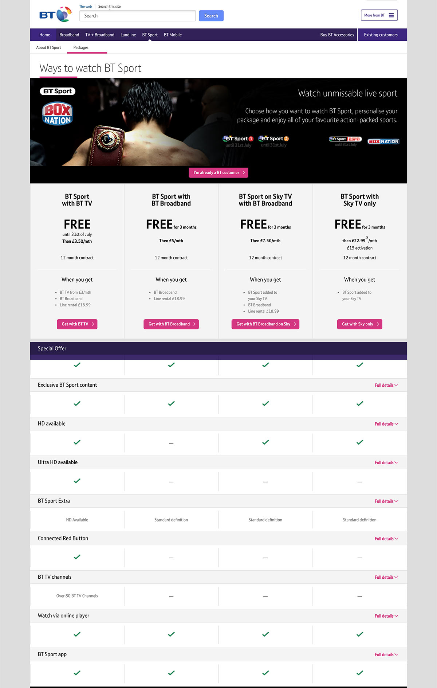
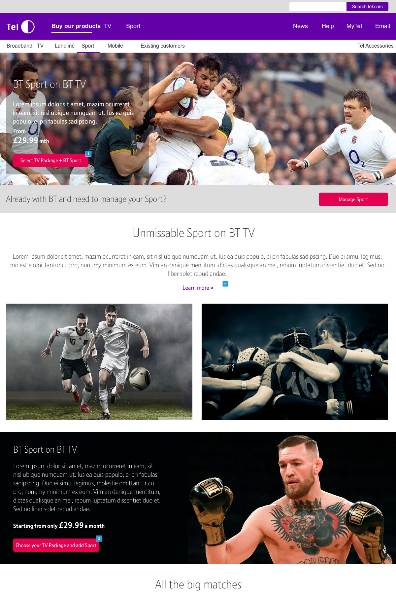
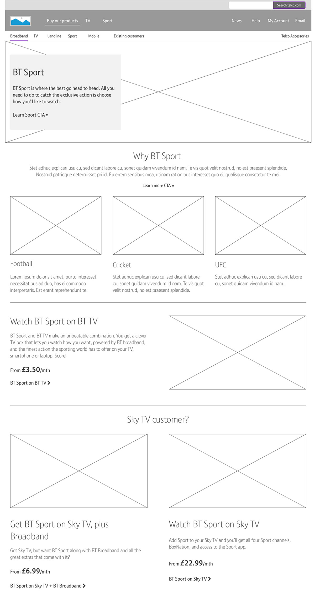
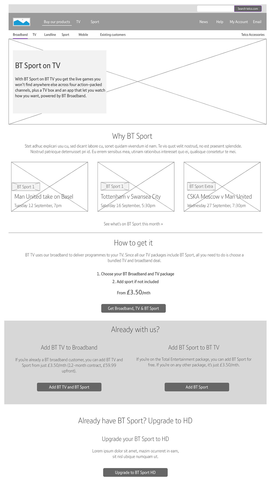
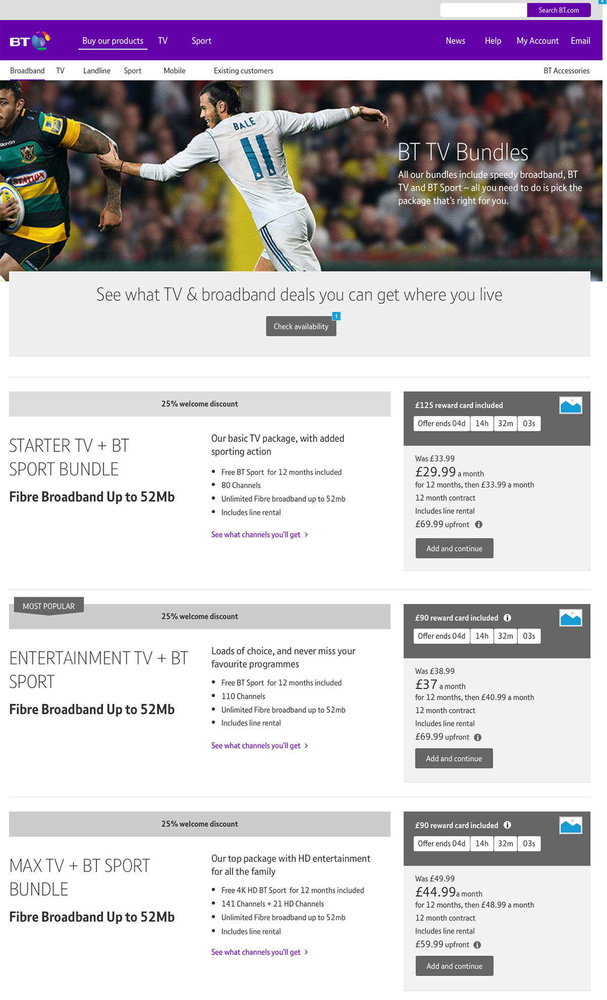
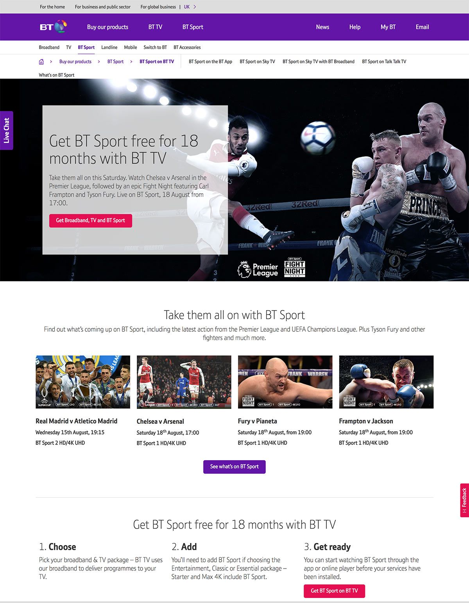

## Introduction
Redesigning the BT Sport sales journeys and simplifying the way users can buy a sports package. 

## The Problem
BT Sport is a complex proposition, we have multiple ways for customers to buy and watch sport, most of which require the customer to order broadband first. How can we try and simplify the journey and increase sports conversion.

  <figure class="fl w-50 border-box pr3 mh0 mv3">
    
  </figure>

  <figure class="fl w-50 border-box pl3 mh0 mv3">
    
  </figure>

## Testing & Iteration
First designs included CTAs at the top of the page and information about what was on BT Sport following on afterwards. This was easy to miss and didn’t do much to set expectations of the journey that followed. 

<figure class="mh0 mv3 ba b--light-silver">
  
</figure>

Second set of designs explained how to buy BT sport, that you would choose your broadband first. Testing showed that users wanted to read more about the benefits of sport before considering a purchase

<figure class="mh0 mv3 ba b--light-silver">
  
</figure>

In the third iteration I made the BT sport landing page talk about the key sports available and introduced a fixtures component to the sales page to help sell what BT sport has to offer 

  <figure class="fl w-50 border-box pr3 mh0 mv3">
    
  </figure>

  <figure class="fl w-50 border-box pl3 mh0 mv3">
    
  </figure>

I also tested a version where BT sport was bundled with Broadband and TV, this got unanimous approval from the participants. Although BT couldn’t support the functionality of the design at the launch of AEM it was enough to get further commitment to improvements after launch. 

<figure class="mh0 mv3 ba b--light-silver">
  
</figure>

## Outcome

New BT Sports journeys were launched and saw a 0.5% lift in conversion. Testing proved that people would rather sport bundled with broadband or TV and the focus for the team is to make this technically possible as the hope is that it could have a significant effect on conversion.

<figure class="mh0 mv3 ba b--light-silver">
  
</figure>

More details available on request.

