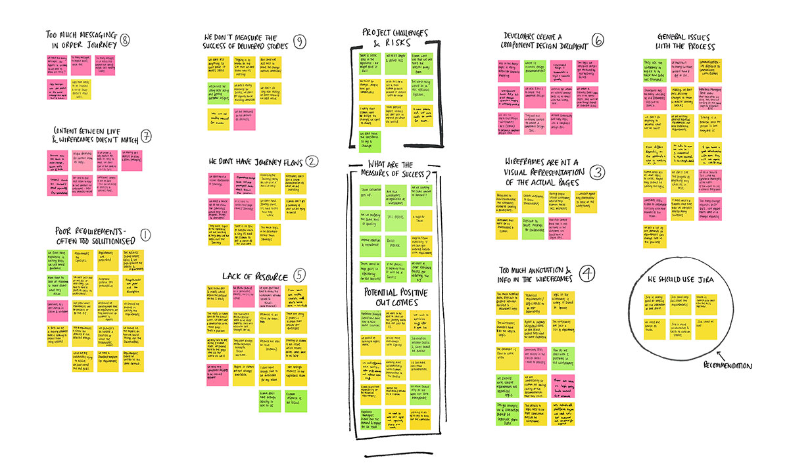

## The Brief
The Order Journey is where all customers on BT complete their purchases, there is currently no UX input into any of the designs and development on this area of the site. The method of updating this area of the site is archaic and needs to be changed to allow UX designers the ability to make recommendations, test designs and have an end to end view of the changes being made across all of BT.com. 

## Skills Used
Brief Auditing, Stakeholder Engagement, User Interviews, Stakeholder Interviews, Workshops, Contextual Inquiry, Competitor Analysis, Experience Mapping, Affinity Mapping, Stakeholder Management, Iteration of Ideas & Retrospectives.

## The Problem
The current process of getting a story into development takes too long and requires specialist/out dated methods of providing requirements to developers. Because of this, there is no oversight of this area of the website, no research or user centred design methods are employed and the UX Design team don’t have an end to end view of the customer journeys. The current “wireframe” contains every single change ever made in the Order Journey, this means the document is unwieldy, difficult to understand and often crashes and can mean work is lost. 

Staff turnover in the Experience Managers team is also a real problem, people join the team thinking that the role is Product Ownership and they are then thrown into managing and updating a wireframe document that is hard to understand and even harder to update. 

The current wireframe created in Axure houses everything and isn’t recognisable as a wireframe

**Original page of designs, requirements and logic**

  <figure class="fl w-50 border-box pr3 mh0 mv3">
    
  </figure>

  <figure class="fl w-50 border-box pl3 mh0 mv3">
    
  </figure>

## Insight & Research

### Workshops

I ran several workshops on this project, the first of which was to get all the Experience Managers on board with the project. The work that I carried out had the potential to change the work of the Experience Managers dramatically, I wanted to get everyone to realise that I was there to help them and to make their lives easier.  We ran through a warm up exercise, I talked through my approach to the project, we wrote down words to describe the current process and followed that up with what their working day would look like if we could wave a magic wand. The key takeaways were: 

- More time to focus on the experience 
- Happier working life
- More time to analyse the requirements
- Ability to test with users
- Easier for new staff to onboard
- Closer working relationships for UX and Experience Managers

### Stakeholder Interviews
I spoke to multiple stakeholders for the project to try and find out if their goals aligned and what their expectations were. They all sit in different teams and have their own agendas but although they all were looking at the project from their own perspectives the following was universally agreed: 

**Experience managers and UX Designers should work together to create solutions**

Both disciplines have different skill sets. The experience mangers understand the way the Order Journey works and how to write technical requirements, the UX designers are able to work out the best experience for the user. 

**We shouldn’t be duplicating work to show stakeholders**

The current wireframe is illegible to anyone outside of the team.

<blockquote class="f3 measure lh-title i mid-gray bl bw2 pl4 border-box b--orange">“Its really difficult for the team to pull together prototypes for walk throughs, they use powerpoint to mock stuff up for stakeholders.” - <cite class="f6 db mt3 fs-normal orange">Stakeholder</cite></blockquote>

**Logic and design requirements aren’t the same thing**

Currently every piece of information is store in the one wireframe document 

<blockquote class="f3 measure lh-title i mid-gray bl bw2 pl4 border-box b--orange">“I think we need a place to put the technical requirements and a place to put the design requirements because they are two different things and they need to be separate.” - <cite class="f6 db mt3 fs-normal orange">Stakeholder</cite></blockquote>

## User Interviews
I devised a few different sets of questions for my user interviews as multiple groups are involved in the process of making changes to the Order Journey but they all interact with the documentation in slightly different ways. Lead Developers, Developers, End to End Designers and Test teams are the primary users of any documentation produced. Experience managers, UX designers and Business Stakeholders are the secondary users, they either create it or use it to sign off that requirements have been met.  Customers & BT agents are the users of the final development but are not involved in how we get to that point. 

I created an affinity map to try and group the issues by theme:

<figure class="mh0 mv3 ba b--light-silver">
  
</figure>

I interviewed over 25 people and from my research I found 10 key areas that are causing issues: 

**Requirements too solutionised**

The business is dictating the solution before it gets to the Experience Managers, they are writing requirements for the demands rather than posing problems. 

<blockquote class="f3 measure lh-title i mid-gray bl bw2 pl4 border-box b--orange">“The issues we’ve had to date is that the acceptance criteria underneath are often quite prescriptive and it will say I want a button on this page and its completely against what a user story should be.” <cite class="f6 db mt3 fs-normal orange">Experience Manager</cite></blockquote>

**There is no way to show a journey through the Order Journey**

There isn’t any record of what journey a particular type of customer takes through the Order Journey, because the wireframe document is hundreds of pages its confusing to try and work out what pages are impacted. 

**Wireframes aren’t a visual representation of how a page should look**

The wireframes can’t be shared with stakeholders for sign off, they aren’t recognisable as a structure of a page and so Experience managers have to create a second document to show what the proposed changes will look like - duplicating the amount of work needed. 

<blockquote class="f3 measure lh-title i mid-gray bl bw2 pl4 border-box b--orange">“We can’t use the wireframes for visuals, its more a place for storing logic behind everything. Its literally just pages and pages of logic, and copy as well.” <cite class="f6 db mt3 fs-normal orange">Experience Manager</cite></blockquote>

**Too much information contained in the Wireframes** 

The wireframes aren’t really a wireframe, they are lists of every single message that appears, all the logic that makes individual components work and requirements for the changes being requested. Every single change that has happened is kept in the document, making it difficult to work out what has changed which means defects are much more likely. 

<blockquote class="f3 measure lh-title i mid-gray bl bw2 pl4 border-box b--orange">“There are a few BTRs that are missed in version control, which leads to defects.” <cite class="f6 db mt3 fs-normal orange">Lead Developer</cite></blockquote>
“There is just so much historical data in there, some of its not really <blockquote class="f3 measure lh-title i mid-gray bl bw2 pl4 border-box b--orange">relevant any more, which means one its confusing for us to decipher between whats there currently and whats completely redundant.” <cite class="f6 db mt3 fs-normal orange">Experience Manager</cite></blockquote> 

**Lack of resource in Development team**

The waterfall process means that there are specific times allocated for the developers to review changes being proposed, there are 4 lead developers who are meant to do this during a 2 week period. Because all the work goes through these 4 people it creates a bottle neck and the developers who will be doing the coding aren’t involved in this process. 

<blockquote class="f3 measure lh-title i mid-gray bl bw2 pl4 border-box b--orange">“We need people who are onboard to be more involved in component design, they should be more upfront. During sizing phase only one or two designers are upfront.” <cite class="f6 db mt3 fs-normal orange">Lead Developer</cite></blockquote>

**How Ecomm use the Wireframes**

From the contextual inquiry its clear to see that the developers are using the document in a different way than anticipated, they only research for the tags relevant to the story they are working on. They use the search within the wireframe and also the browser to find what they are looking for, ignoring all other information on the page. 

**Developers create their own Design Document**

There was a lot of scepticism about whether Developers created their own documentation, the feeling was that they were just relying on the wireframes. In reality they copy the relevant logic and screenshot sections of the wireframe into a word document.

<blockquote class="f3 measure lh-title i mid-gray bl bw2 pl4 border-box b--orange">“We take a screen shots and then copy all the logic into a table in the document. The component designers add things into the document and then we review it.” <cite class="f6 db mt3 fs-normal orange">Lead Developer</cite></blockquote>

**Content between wireframes and live doesn’t match**

Changes to the content and messaging are often made to the live site without going through the Experience Managers, the wireframes are then out of date and so defects are raised by the test teams. The developers are measured on the amount of defects raised. 

<blockquote class="f3 measure lh-title i mid-gray bl bw2 pl4 border-box b--orange">“The business will modify the content on live so we get defects saying the content is not in sync with the wireframes.” <cite class="f6 db mt3 fs-normal orange">Lead Developer</cite></blockquote>

**Copy in the Order Journey isn’t being edited or proofed**

None of the copy in the Order Journey has gone through a central point, it has been added to over many years and has very little consistency in its tone of voice. 

**The measures of success are missing**

No user testing is being carried out on the Order Journey, everything that goes live is just the assumption of someone in the business. The Experience Mangers would like to be able to push back on some of the requests but don’t have the ability to do this with out the proof of testing. 

## Competitive Analysis

I looked at three different competitors to see how managed their digital workflows, I met with people from each team and asked them a series of questions about how they approached similar tasks in their respective companies. 

### Government digital services

I spoke to a digital designer and Project Manger at GDS to find out how they manage their digital workflow. They use Jira to track changes and write acceptance criteria and user stories to document what is being requested. Alongside Jira they produce prototypes in code, they have an in-house prototyping tool that allows them to quickly mockup new services. 

“The acceptance criteria is just a list of criteria and a standard user story. This gives the developer a better insight to what is being asked.”

“Product managers are involved and we try to get the developers involved at the same time. This works well, we can have more ideas and technically it helps with knowing what is possible…we don’t have to do complex annotations because we have the devs involved from the start and then understand the desired outcomes.”

### EE

EE are using Jira to track development stories and Confluence to house all additional information relating to those stories and build up a history of previous releases. The wireframes and design specifications are produced separately and can be attached to tickets when appropriate. This allows them to use different software to create the constituent parts and then use Jira to house them all in one place. 

“We use Jira & Confluence - solution designers use confluence to house all there additional information about the services and apis. Confluence is now where we are building up a historic view of what has happened.”

### BT - Digital Transformation Team

In another area of the business they have successfully transformed the sales area of the website by migrating to the AEM platform, they did this with an agile approach and used Jira to house acceptance criteria.

“We write BDDs - widely used for write acceptance criteria. Everything is on the Jira ticket for the testers to test against.” 

“We created specifications and diagrams to explain flows and make it easier for the devs to get on with it.”

## Mapping the journey

I put together a workshop to create an Experience Map of the entire Order Journey cycle from the Experience Managers point of view, each cycle lasts three months. We mapped the following:

- Time (This is measured in Quality Gates)
- Stages 
- Actions they undertake
- Are the wireframes impacted
- People involved 
- Thoughts and feelings 

<figure class="mh0 mv3 ba b--light-silver">
  
</figure>

Doing this we were able to map out what happens at each stage and find the pain points in the journey. Once I had created a digital version of the experience I could then see parallels between the pain points and the main themes that had been uncovered in my user interviews. 

<figure class="mh0 mv3 ba b--light-silver">
  
</figure>

## The Idea

It was pretty clear that we are storing too much information in one place, it was very difficult to manage the file and the Developers were only interested in what needed to change. We need a way of being able to store what happens each sprint so that the test teams can refer back to historic changes and check the logic. I broke my idea down into the following recommendations: 

- Experience Managers to get involved earlier in the process and write the requirements. The business should only be supplying high level stories for the Experience Managers to break down into requirements. 

- Journey flows to be created as part of the documentation. This will help everyone understand the given journey being outlined. 

- Wireframes to be easy for anyone to understand and only relate to specific story. These are to be the responsibility of the UX team. 

- Logic, Acceptance Criteria and Copy to be stored in separate documents all linked to/uploaded in Jira. 

- Component designers could start getting involved with the projects earlier on, enabling a better working relationship between them and the Experience Managers. This could also relieve burden on the Design Leads. 

- With a new set of documentation stored in Jira, per demand story would the Lead developers still need to create a component design document? If they do then it should be much quicker for them but they could use the Jira ticket to track their comments and updates to the ticket. 

- Content should be kept separately from wireframes. All copy requests should be handled by the Experience Managers and run through the copy team before being put live. 

- A review of all the messaging in the order journey, remove any ASMs/RTMs that are not needed or are non essential. 

- Improve tagging in the Order Journey to help monitor changes. More testing as part of major programme testing.

## Testing & Iteration
I set up a working group, a new instance of Jira and got the Experience Managers some guidance on how to write user stories and acceptance criteria. I came up with a pared back style for the wireframes which would show the structure of a page without the need for correct copy to be present, this could be added to the tickets once it had been to a copy writer. 

<figure class="w-60 mh0 mv3 ba b--light-silver">
  
</figure>

Wireframes, Journey Flows, Copy and Visual Design could all be added to the Jira ticket where needed. We trialled 4 stories outside of the normal cycle and got feedback from developers, this meant that they were part of the pilot and told us if things weren’t working. During this time we went back and forth with the Developers to optimise how we wrote the user stories and make sure that the requirements were robust. 

## Outcome
Efficiency has been improved by 40%, the Experience managers are able to deliver that much more work; equivalent to £360,000 a year in their time alone, not taking into account the added efficiencies for the developers.  

- More cross team collaboration
- We can deliver more work into the developers
- Developers can access the tickets as soon as they are ready, they don’t have to wait for all stories to be complete
- Experience managers no longer having to work with outdated processes, skills are transferrable to other industries 

The development team are now looking into building a copy module that will house all the copy and automatically update if a change is made to the live site, this will mean less defects raised due to the mismatch of information.

