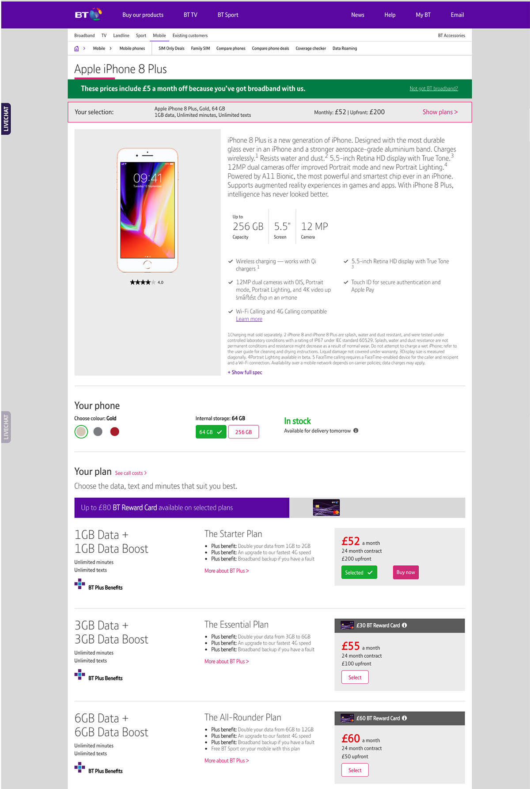
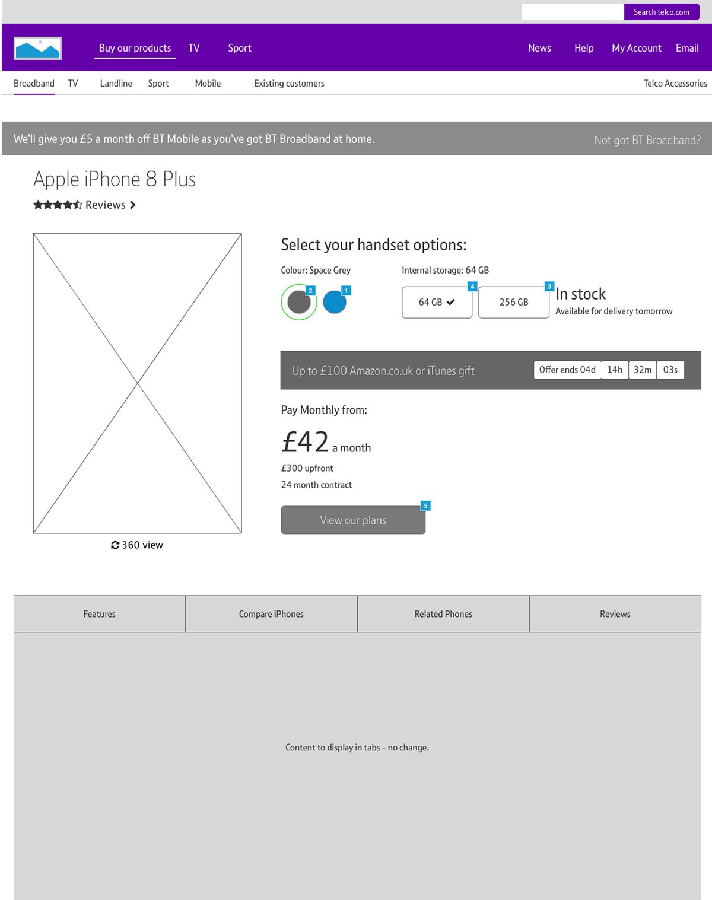
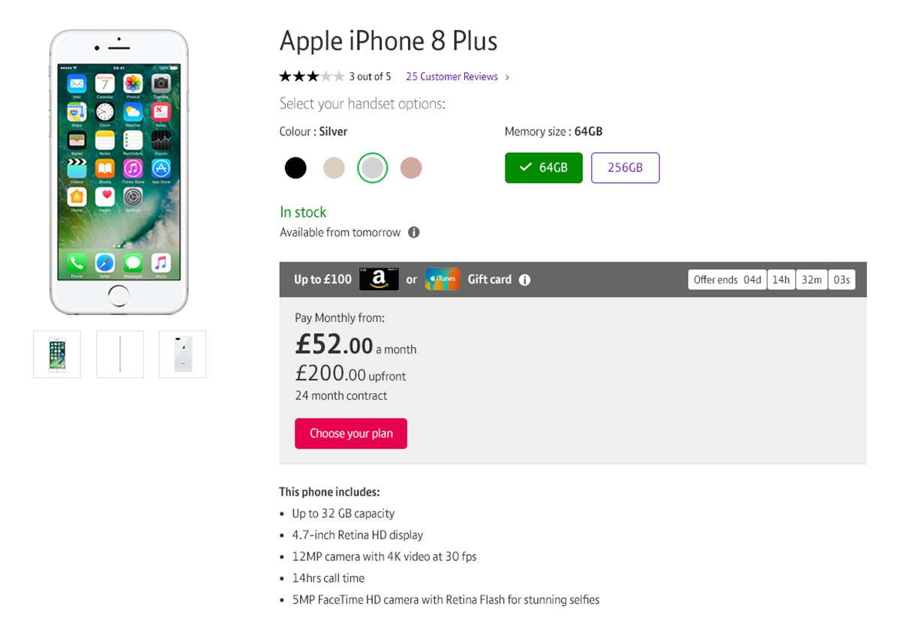
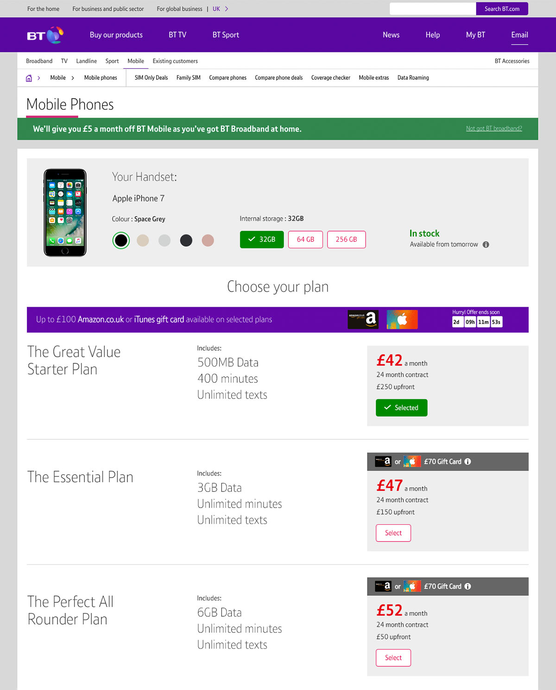

## Introduction

BT Mobile has been neglected and conversion is at an all time low, the rest of the core BT products have been redesigned but the journey of buying a handset and contract are now out of date. 

## The Brief
Having successfully delivered phase one of the AEM relaunch which included Broadband, TV, Sports and Sim products, we are now moving into phase two where we have scope to redesign the mobile handset journey. Using SessionCam we have noticed that users are struggling to add a handset and plan to their basket. We think that the “Your selection” area at the top of the page is causing issues and therefore conversion to the basket summary page is suffering. We would also like to try and improve conversion from the handset grid to product page.

  <figure class="fl w-third border-box ph3 mh0 mv3">
    
  </figure>

  <figure class="fl w-third border-box ph3 mh0 mv3">
    
  </figure>

  <figure class="fl w-third border-box ph3 mh0 mv3">
    
  </figure>

## Skills Used
Competitive Analysis, Heuristic Analysis, Prototyping & User Testing 

## The Problem
The BT Mobile section of the site is outdated, we have redesigned the rest of the core BT products and so the look and feel is now very different - its feels like a different website. Conversion is now at an all time low of 0.6%, especially the conversion of the product details page which is converting at 14%. 

## The Idea
Separating out the handsets from the plans, there is currently a lot of decisions being made on one page and if we can reduce cognitive load then we will hopefully be able to raise conversion.

  <figure class="fl w-50 border-box pr3 mh0 mv3">
    
  </figure>

  <figure class="fl w-50 border-box pl3 mh0 mv3">
    
  </figure>

## Testing & Iteration

Two days of user testing with 10 participants at Spotless Labs. Testing revealed that we had stripped too much information out of the handsets page, in response I added bullet point features about the handsets to give the users more reassurance about the phone they were buying. 

## Outcome
These pages are currently in development and are due to launch November 2018.

  <figure class="fl w-50 border-box pr3 mh0 mv3">
    
  </figure>

  <figure class="fl w-50 border-box pl3 mh0 mv3">
    
  </figure>

More details available on request.

